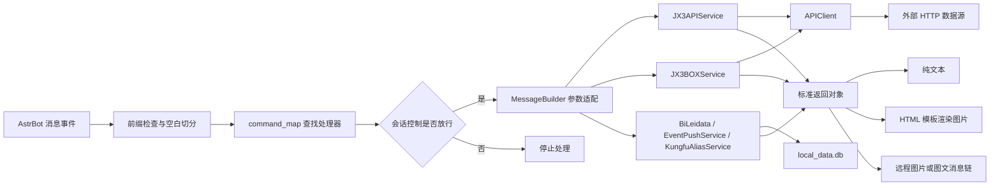

# astrbot_plugin_jx3

<p align="center">
  
</p>

<p align="center">
  基于 AstrBot 的剑网三综合数据查询插件
</p>

`astrbot_plugin_jx3` 通过 JX3API、JX3BOX 等数据源查询《剑网3》游戏数据，并根据功能将结果发送为纯文本、图片、图文消息或两轮交互消息。插件同时提供本地避雷记录和基于 JX3API WebSocket 的实时事件推送。


## 功能特点

- 中文触发词覆盖活动、名剑、排行、交易、阵营、角色、奇遇、百战、家园、社区等场景。
- 支持纯文本、远程图片、HTML/Jinja2 渲染图片和图文消息链。
- 支持 `宏`、`资历` 以及帮会、阵营、其他排行榜的 10 秒两轮交互，超时默认选择第一项。
- 查询图片统一使用浅色高对比主题，并可在插件配置页调整渲染清晰度、输出格式和 JPEG 质量。
- 支持本地 SQLite 避雷记录的增删改查。
- 支持按 AstrBot 会话分别开启总开关和具体 JX3API 实时事件订阅。
- 复用 `aiohttp.ClientSession`，统一处理 GET、POST、JSON、图片和分页请求。
- JX3BOX 的 Node、Next2、CMS 请求统一封装，交易行基础物品数据支持本地快照缓存和过期兜底。
- 内置 47 个页面片段，通过公共布局与样式在本地组装为完整 HTML，并附带通用、沙盘、门派/心法和奇遇图标资源。

## 数据来源

| 数据源 | 代码入口 | 主要用途 |
| --- | --- | --- |
| [JX3API](https://www.jx3api.com/) | `core/jx3api_data.py`、`core/event_push.py` | 游戏查询、资历分布、沙盘据点数据及 WebSocket 实时事件 |
| [JX3BOX](https://www.jx3box.com/) | `core/jx3box_data.py` | 奇遇攻略、配装、宏及交易行 |
| 本地 SQLite | `core/sqlite.py`、`core/bilei_data.py` | 心法别名、避雷记录、事件订阅和基础数据缓存 |

外部数据源的可用性、数据时效和字段结构均不由本插件控制。接口变更、网络异常、凭据权限不足或上游限流都可能导致查询失败。

## 安装

### 环境要求

- AstrBot `>= 4.24.1`（管理页依赖 Plugin Pages）
- 能够运行当前 AstrBot 版本的 Python 环境
- 能够访问插件使用的外部数据源
- 图片类指令需要 AstrBot 的 HTML 渲染能力正常可用

### 安装插件

将仓库放入 AstrBot 的插件目录：

```text
data/plugins/astrbot_plugin_jx3
```

也可以在 AstrBot 根目录执行：

```bash
git clone https://github.com/qsc20001102/astrbot_plugin_jx3.git data/plugins/astrbot_plugin_jx3
```

使用 AstrBot 所在的 Python 环境安装依赖：

```bash
pip install -r data/plugins/astrbot_plugin_jx3/requirements.txt
```

随后重启 AstrBot 或重新加载插件，并在 AstrBot 管理面板中完成插件配置。

### Python 依赖

| 依赖 | 用途 |
| --- | --- |
| `aiohttp` | 异步 HTTP 请求与连接复用 |
| `aiofiles` | 异步读取 HTML 模板 |
| `aiosqlite` | 异步访问本地 SQLite 数据库 |
| `matplotlib` | 当前依赖清单保留的绘图依赖；v3.2.1 业务代码未直接导入 |

## 插件配置

配置结构由 `_conf_schema.json` 定义。

| 配置项 | 类型 | 默认值 | 说明 |
| --- | --- | --- | --- |
| `prefix.enable` | `bool` | `false` | 是否启用指令前缀检查 |
| `prefix.text` | `string` | `剑三` | 指令前缀内容 |
| `jx3api_token` | `string` | 空 | JX3API Token |
| `jx3api_ticket` | `string` | 空 | 部分名剑和心法接口需要的推栏 Ticket |
| `jx3api_wss` | `string` | `wss://socket.nicemoe.cn` | JX3API 事件通道地址 |
| `jx3api_wss_token` | `string` | 空 | 事件版令牌；免费事件无需填写 |
| `image_render_quality.device_scale_factor` | `string` | `1.3` | 渲染清晰度，可选 `1.0`、`1.3`、`1.8` |
| `image_render_quality.format` | `string` | `jpeg` | 图片输出格式，可选 `jpeg`、`png` |
| `image_render_quality.jpeg_quality` | `int` | `100` | JPEG 图片质量，范围 `1-100`，PNG 下不生效 |

会话区服绑定、区服别名和事件订阅均保存在本地 SQLite。修改 WebSocket 地址或事件版令牌后需要重新加载插件。

### Token 与 Ticket

JX3API Token 可从 [JX3API](https://www.jx3api.com/) 获取。推栏 Ticket 通常来自推栏客户端的登录请求，属于敏感凭据。

当前代码会同时传入 Token 和 Ticket 的指令有：

- `战绩`、`名剑排行`、`名剑统计`
- `阵眼`、`资历排行`、`技能`、`奇穴`

其余在下方标记为“Token”的指令只传入 JX3API Token。是否还需要对应接口权限，以数据提供方的实际规则为准。

## 使用方式

如已启用指令前缀，可发送：

```text
剑三 功能
剑三 日常
剑三 战绩 梦江南 角色名 33
```

前缀与指令之间的空格可以省略，例如 `剑三日常` 也能触发。默认关闭前缀检查，可直接发送 `日常`；启用后才要求使用配置的前缀。

参数规则：

- 指令和参数使用空白字符分隔。
- `[参数]` 表示可选参数；未加方括号的参数必须提供。
- 当前分发器按空白切分消息，因此角色名、物品名、备注等单个参数不能包含空格。
- 未识别的消息会被忽略；已识别的指令会停止继续传播给其他插件。
- 缺少必填参数、数字转换失败或执行异常时，入口层统一回复 `参数错误或执行失败`。
- 未绑定区服时按指令表提供标准参数。绑定后可以省略 `server` 参数；显式填写完整参数时仍优先使用本次输入的区服。在区服参数位置填写 `全区` 时，会忽略会话绑定并向接口传入空区服以查询全区数据。
- 标准区服名和 WebUI 中配置的别名都可用于查询。对于区服后的可选参数，分发器通过当前有效区服目录和别名判断首个参数是显式区服还是后续参数。
- 心法类指令会在入口层把标准心法名或 WebUI 配置的心法别名统一解析为标准名称；当前适用于试炼排行、阵眼、配装、技能、奇穴、小药和宏。门派筛选参数不参与心法别名解析。

### 会话区服绑定

| 指令 | 作用 |
| --- | --- |
| `绑定区服` | 查看当前会话的绑定状态 |
| `绑定区服 梦江南` | 将当前会话绑定到指定区服；支持区服别名 |
| `解绑区服` | 解除当前会话绑定 |

例如会话已经绑定 `梦江南` 后，`战绩 角色名 33` 等价于 `战绩 梦江南 角色名 33`；仍可发送 `战绩 唯我独尊 角色名 33` 临时查询其他区服，或发送 `战绩 全区 角色名 33` 查询全区数据。

## 指令参考

凭据列含义：

- **无**：当前实现不会向该查询传入 `jx3api_token` 或 `jx3api_ticket`。
- **Token**：当前实现会传入 `jx3api_token`。
- **Token + Ticket**：当前实现会同时传入两项凭据。
- 本地功能和任务状态查询不访问对应的游戏查询接口。

### 帮助与活动情报

| 指令 | 说明与输出 | 凭据 |
| --- | --- | --- |
| `功能` | 渲染完整功能帮助图 | 无 |
| `日常 [延后天数]` | 查询指定偏移天数的活动日历，默认当天；文本 | 无 |
| `日常预测` | 查询未来 15 天日历；图片 | 无 |
| `穹野卫`、`披风会`、`云从社`、`楚天社` | 查询对应地图活动；图片 | 无 |
| `关隘` | 查询关隘首领状态；图片 | Token |
| `赤兔`、`本周赤兔` | 查询当日或本周赤兔记录；文本 | Token |
| `阵营奉献 [阵营]` | 查询阵营奉献事件，固定最多 50 条；图片 | Token |
| `烟花 服务器 角色 [条数]` | 查询指定服务器的烟花记录；条数默认为 50，须为正整数，填写时放在角色名称后；已绑定会话可省略服务器；图片 | Token |
| `刷马 服务器` | 查询刷马聊天情报；文本 | Token |
| `马场 服务器` | 查询未过期马场记录；文本 | Token |

### 名剑与排行榜

| 指令 | 说明与输出 | 凭据 |
| --- | --- | --- |
| `战绩 服务器 角色 [模式]` | 角色名剑战绩，模式可选 `22`、`33`、`55`，默认 `33`；图片 | Token + Ticket |
| `名剑排行 [模式] [数量]` | 名剑大会排行，默认 `33`、50 条；图片 | Token + Ticket |
| `名剑统计 [模式]` | 名剑门派统计，模式默认 `33`；图片 | Token + Ticket |
| `跨服名剑 服务器 [模式]` | 跨服名剑队伍榜单，模式可选 `0`（2v2）、`1`（3v3）、`2`（5v5），默认 `1`；图片 | Token（LV.2） |
| `武林争霸 服务器 [阵营]` | 武林争霸赛帮会榜，阵营可选 `1`（浩气）、`2`（恶人），默认 `1`；图片 | Token（LV.2） |
| `捕快荣誉 服务器` | 捕快荣誉榜，展示角色、帮会、门派、阵营和抓捕数；图片 | Token（LV.2） |
| `江湖浪客 服务器` | 江湖浪客榜，展示角色、帮会、门派、阵营、抓捕数和敌对数；图片 | Token（LV.2） |
| `决斗挑战 服务器 [模式]` | 决斗挑战悬赏榜，模式可选 `1`（公开）、`2`（私密），默认 `1`；图片 | Token（LV.2） |
| `帮会排行 服务器` | 回复序号选择神兵宝甲或爱心帮会榜单，最多保留前 50 条；图片 | Token |
| `阵营排行 服务器` | 回复序号选择赛季、上周或本周阵营榜单，最多保留前 50 条；图片 | Token |
| `其他排行 服务器` | 回复序号选择名士、老江湖、名师等其他榜单，最多保留前 50 条；图片 | Token |
| `试炼排行 服务器 心法` | 试炼之地排行；图片 | Token |

三个聚合排行榜指令都会先发送可选榜单菜单；回复对应序号后才查询并渲染结果。已绑定区服的会话可以省略服务器参数。

### 物价与交易

| 指令 | 说明与输出 | 凭据 |
| --- | --- | --- |
| `阵营拍卖 服务器 [物品] [数量]` | 阵营拍卖记录，默认最多 50 条；图片 | Token |
| `的卢 服务器` | 的卢拍卖记录；图片 | Token |
| `金价 服务器 [数量]` | 金价行情，默认 15 条；图片 | Token |
| `物价 外观名称 [服务器]` | 外观价格记录；图片 | Token |
| `成本 服务器 物品名称 [来源]` | 制造成本，来源默认 `0`；图片 | Token |
| `看号 万宝楼编号` | 万宝楼账号详情；文本 | Token |
| `交易行 服务器 物品` | 本地模糊匹配物品后批量查询 JX3BOX 交易行价格；图片 | 无 |

`交易行` 会按“完全匹配、前缀匹配、包含匹配”排序，最多取 50 个物品 ID。基础物品分组会缓存 30 天；价格结果展示物品图标、砖/金/银/铜价格、样本数量和数据时间。

### 阵营战场

| 指令 | 说明与输出 | 凭据 |
| --- | --- | --- |
| `帮战 服务器` | 帮战记录；图片 | 无 |
| `沙盘 服务器` | 查询 JX3API 据点归属并使用本地图层渲染阵营沙盘；已绑定会话可省略服务器 | Token |
| `诛恶 服务器` | 诛恶事件，固定最多 20 条；图片 | Token |

### 角色名片与奇遇

| 指令 | 说明与输出 | 凭据 |
| --- | --- | --- |
| `名片 服务器 角色` | 缓存名片，发送文字与角色图片 | Token |
| `全名片 服务器 角色` | 历史名片，发送文字与多张图片 | Token |
| `随机秀 服务器 [门派] [体型]` | 随机角色秀；图文消息 | Token |
| `奇遇 服务器 角色` | 角色奇遇记录；图片 | Token |
| `查询 服务器 角色` | `奇遇` 的别名 | Token |
| `未出 服务器 角色` | 未触发奇遇；图片 | Token |
| `汇总 服务器 [天数]` | 区服奇遇汇总，默认 7 天；图片 | Token |
| `近期 服务器 [数量]` | 区服近期奇遇，默认 20 条；图片 | Token |
| `统计 奇遇 [服务器] [数量]` | 指定奇遇的触发统计，默认 20 条；图片 | Token |
| `攻略 奇遇` | 从 JX3BOX 获取奇遇攻略正文并渲染；图片 | 无 |

### 百战、角色与心法

| 指令 | 说明与输出 | 凭据 |
| --- | --- | --- |
| `精耐 服务器 角色` | 角色百战精耐记录；图片 | Token |
| `百战` | 本周百战首领；图片 | Token |
| `成就 服务器 角色 成就` | 查询指定成就；图片 | Token |
| `角色 服务器 名称` | 查询角色详情与历史信息；文本 | Token |
| `阵眼 心法` | 查询阵眼效果；文本 | Token + Ticket |
| `配装 心法 [类型]` | 从 JX3BOX 获取推荐配装链接；文本。当前 `类型` 参数已接收但尚未用于请求筛选 | 无 |
| `资历排行 [服务器] [门派]` | 资历排行榜；图片 | Token + Ticket |
| `技能 心法` | 心法技能；图片 | Token + Ticket |
| `奇穴 心法` | 心法奇穴；图片 | Token + Ticket |
| `宏 心法` | 先返回动态宏列表，10 秒内回复序号后返回宏文本和帖子内容；超时默认选择热度第一项 | 无 |
| `资历 服务器 角色` | 返回固定资历分类菜单，10 秒内回复序号后通过 JX3API 渲染资历进度图 | Token + Ticket |

`资历` 的 `1` 表示总览，`2-19` 固定对应杂闻、武学、修为、装备、技艺、阅读、任务、足迹、战斗、声望、秘境、帮会、阵营、节日、活动、风雨江湖路、家园和剑侠录，不再使用本地资历菜单和点数缓存。第二轮只需回复数字，不需要再次添加插件前缀；10 秒未选择时默认把首项 `{"1": "总览"}` 交给次轮查询并继续渲染。

### 游戏社区与休闲

| 指令 | 说明与输出 | 凭据 |
| --- | --- | --- |
| `发言 服务器 角色 [条数] [页数]` | 角色发言记录，默认 20 条、第 1 页；图片 | Token |
| `统战 [服务器]` | 统战频道统计；文本 | 无 |
| `小药 [心法]` | 小吃小药推荐；图片 | 无 |
| `骗子 UID [服务器]` | 查询欺诈记录；文本 | Token |
| `花价 服务器 [名称] [地图]` | 家园鲜花价格；图片 | 无 |
| `装饰 名称` | 家园装饰信息；图片 | 无 |
| `器物 地图名称` | 器物图谱；图片 | 无 |
| `拜师 服务器 [关键词]` | 师父列表，固定最多 50 条；图片 | Token |
| `收徒 服务器 [关键词]` | 徒弟列表，固定最多 50 条；图片 | Token |
| `维护 [数量]` | 维护公告，默认 5 条；文本 | 无 |
| `新闻 [数量]` | 新闻资讯，默认 5 条；文本 | 无 |
| `招募 服务器 [副本]` | 团队招募，固定最多 50 条；图片 | Token |
| `团长 服务器 [名称]` | 按团长搜索招募；图片 | Token |
| `团牌 服务器 [内容]` | 按团牌内容搜索招募；图片 | Token |
| `答案之书` | 随机答案；文本 | 无 |
| `舔狗语录` | 随机语录；文本 | 无 |
| `疯狂星期四`、`彩虹屁`、`毒鸡汤`、`朋友圈` | 指定类型的文案；文本 | Token |
| `喝什么`、`吃什么`、`骚话`、`渣男语录` | 随机文案；文本 | 无 |

### 百度贴吧、系统工具与副本

| 指令 | 说明与输出 | 凭据 |
| --- | --- | --- |
| `贴吧物价 名称 [服务器] [数量]` | 贴吧物价记录，默认 5 条；文本 | Token |
| `818 [服务器] [数量]` | 随机 818 内容，默认 10 条；文本 | Token |
| `科举 题目 [条数]` | 科举题目搜索，默认 5 条；文本 | 无 |
| `区服` | 全区服状态；图片 | 无 |
| `开服 服务器` | 指定服务器开服状态；文本 | 无 |
| `技改` | 最近技改记录；文本 | 无 |
| `解密` | 当前秘境解密信息；文本 | Token |
| `副本 服务器 角色` | 角色副本记录；图片 | Token |
| `掉落 物品 [服务器] [数量]` | 副本掉落统计，默认 20 条；图片 | Token |

### 本地避雷

| 指令 | 说明与输出 |
| --- | --- |
| `避雷添加 名称 备注` | 写入名称、备注、当前时间和发送者名称 |
| `避雷查看` | 查看全部记录；图片 |
| `避雷查询 名称` | 按名称模糊查询；图片 |
| `避雷修改 ID 名称 备注` | 按 ID 更新记录，同时覆盖修改时间和修改人 |
| `避雷删除 ID` | 按 ID 删除记录 |

避雷功能没有会话内的用户角色校验。在“会话控制”放行的会话中，只要能够触发插件指令，当前实现就允许新增、修改和删除记录；如需限制到指定管理员，仍应在 AstrBot 或消息平台层配置权限。

### 实时事件推送

| 指令 | 作用 |
| --- | --- |
| `事件推送`、`事件推送 状态` | 查看当前会话的总开关和已订阅事件 |
| `事件推送 开启` | 开启当前会话的事件推送总开关 |
| `事件推送 关闭` | 关闭总开关；保留各事件的订阅选择 |
| `事件推送 2001 开启` | 为当前会话订阅事件 `2001` |
| `事件推送 2001 关闭` | 为当前会话取消订阅事件 `2001` |
| `事件推送 列表` | 查看支持的全部事件编号 |

总开关和具体事件开关必须同时开启，消息才会发送到当前会话。事件正文包含 `server` 时，只向绑定该区服和未绑定区服的订阅会话发送；不含服务器的新闻、版本更新等事件不受区服过滤影响。插件已覆盖 JX3API 当前 39 种 WebSocket 事件，并按各事件的官方字段输出可读中文消息。免费事件为：`2001` 开服状态、`2002` 官方新闻、`2003` 版本更新、`2004` 八卦速报、`2005` 关隘首领、`2006` 云丛预告；其他事件需要独立的事件版令牌，可通过 `事件推送 列表` 查看全部编号。

### WebUI 插件管理

AstrBot 插件详情页中的“剑网三插件管理”页面提供五个页签：会话控制、事件推送、区服绑定、区服别名和心法别名。顶部通过 JX3API `POST /token/stats` 展示当前配置令牌的等级、已用次数、剩余次数和有效状态；未配置令牌或接口暂时不可用时显示未获取，不影响其他管理功能。会话控制为默认页签，页面会明确标出当前真正生效的模式，并区分尚未保存的模式选择。该功能默认使用“全部会话”，也可切换为白名单或黑名单；会话 ID 可从已有绑定和订阅记录中选择，也可直接输入，并可维护名单类型和备注。空白名单不放行任何会话，空黑名单放行全部会话，名单策略同时作用于插件指令和实时事件推送。

区服绑定页可使用自定义会话 ID 添加记录，绑定区服只能从标准区服下拉框选择。编辑已有记录时会话 ID 保持只读，只在绑定区服列内修改，点击解除绑定会直接删除该行。事件推送页显示所有会话的总开关及订阅编号。区服别名页展示完整标准区服目录，标准名称只读，只能行内编辑别名；心法别名页隐藏 JX3BOX 配装 ID，标准心法名称只读，同样只允许行内编辑最多 5 个别名。两个别名页均可使用随插件分发的 JSON 种子完整覆盖数据库并恢复默认配置。管理页通过 AstrBot Plugin Pages 桥接调用插件 Web API，不直接访问 Dashboard 凭据。

## 业务流程



### 1. 初始化与销毁

`main.py` 中的 `Jx3ApiPlugin` 是插件入口。构造阶段完成以下工作：

1. 读取前缀、Token、Ticket 和 WebSocket 配置。
2. 计算插件目录、AstrBot 数据目录、本地 SQLite 和模板目录路径。
3. 把 `templates/img`、`templates/img/sand`、`templates/sect`、`templates/serendipity` 中的图片读取为 base64 Data URL。
4. 创建本地数据库、两个数据服务、心法别名服务、会话控制服务、避雷服务、事件推送服务、WebUI 服务和消息构建器。

异步初始化阶段会连接数据库并创建以下本地表：

- `bilei`：避雷记录。
- `event_push_subscriptions`：按 AstrBot 会话保存事件总开关和每个事件编号的订阅开关。
- `session_server_bindings`：两列结构，保存会话 ID 与绑定区服。
- `session_control_settings`：保存当前会话控制模式，首次初始化默认为 `all`。
- `session_control_entries`：保存白名单或黑名单会话 ID 及备注。
- `server_aliases`：保存标准区服名及其 JSON 别名列表。
- `kungfu`：保存 JX3BOX 配装 ID、标准心法名及最多 5 个别名。
- `trade_item_cache`：JX3BOX 交易行基础物品数据缓存及更新时间。

`kungfu` 表首次创建时从 `data/kungfu.json` 幂等导入 32 条默认心法，`server_aliases` 表从 `data/server_aliases.json` 幂等导入默认区服别名；已存在的本地记录均不会被覆盖。随后启动 JX3API WebSocket 事件通道并建立指令映射。插件停用时会关闭事件通道、两个 HTTP Session 和本地 SQLite 连接。

### 2. 指令分发

入口监听全部消息事件：

1. `parse_message()` 检查前缀并使用 `str.split()` 切分消息。
2. 第一段作为指令，其余段作为位置参数。
3. `command_map` 将中文触发词映射到 `MessageBuilder` 方法。
4. `_prepare_server_args()` 和 `_prepare_kungfu_args()` 根据处理器参数名统一补齐区服绑定并解析区服、心法别名。
5. `_call_with_auto_args()` 通过 `inspect.signature()` 读取参数签名，按注解转换 `int` 和 `float`。
6. 找不到指令时忽略消息；找到指令后停止事件继续传播并调用处理器。

分发器不会检查多余参数，多出的参数会被忽略。缺少必填参数会抛出异常并返回统一错误提示。

### 3. 数据服务

两个数据服务按上游来源拆分：

- `JX3APIService`：以 `https://www.jx3api.com` 为根地址，通过 GET 请求实现主体功能、资历分布和沙盘据点查询。
- `JX3BOXService`：通过统一请求入口访问 JX3BOX 的 Node、CMS 和 Next2 服务，负责攻略、配装、宏及交易行。

服务方法通常返回统一结构：

```python
{
    "code": 0,
    "msg": "功能函数未执行",
    "data": {},
    "temp": "",
    "icons": {}
}
```

成功时设置 `code=200`；失败时保留非 200 状态并在 `msg` 中返回原因。图片功能会在 `temp` 中放入已加载的 HTML 模板正文，在 `data` 中放入模板上下文。

### 4. HTTP 请求层

`core/request.py` 中的 `APIClient`：

- 延迟创建并复用一个 `aiohttp.ClientSession`。
- 默认总超时时间为 10 秒。
- 支持 GET、JSON POST 和分页拉取。
- 根据 `Content-Type` 自动返回 JSON 或二进制数据。
- 兼容 JX3API 常见成功码 `200`、`"0"`、`0`、`1`。
- 可通过 `out_key` 提取响应中的指定字段。
- 网络、HTTP、JSON 和业务码异常统一记录日志并返回 `None`。

业务服务在 `APIClient` 之上维护各自的基础请求方法。`JX3APIService` 以 `https://www.jx3api.com` 为固定根地址；`JX3BOXService._base_request()` 根据 `node`、`next2`、`cms` 数据源选择基础地址，并统一转发 GET/POST 参数和 `out` 返回字段。JX3BOX 业务代码只传接口路径，不再重复拼接完整域名。

### 5. 消息与图片渲染

`core/message.py` 根据业务结果选择输出方式：

- `plain_msg()`：纯文本。
- `T2I_image_msg()`：向模板注入业务数据和本地图标，再调用 AstrBot HTML 渲染器按插件配置生成图片。
- `image_msg()`：直接发送远程图片 URL 或图片数据。
- `plain_chain()`：发送文本与图片组成的富媒体消息链；结果包含 HTML 正文时，会将其渲染为图片组件追加到消息链。
- `handler_plain_image_msg()`：通用两轮会话；首轮函数直接返回 `{"1": "总览", "2": "杂闻"}` 形式的数字键值对（无 `code`、`msg`、`data` 外层），处理器据此生成序号文本；选择后裁剪为只含所选项的新字典交给次轮函数，再由注入的输出器发送结果；超时固定选择第一项。
- `hong()`、`zili()` 及三类聚合排行榜入口：保持统一调用结构接入上述两轮会话处理器，并按各自需要选择图文消息链或标准图片流程输出结果。

图片默认使用 JPEG 质量 `100`、完整页面截图和 `1.3` 倍设备像素比。可以在插件配置页的“图片渲染质量”分组切换 JPEG/PNG、调整 JPEG 质量，并选择 `1.0`、`1.3`、`1.8` 设置渲染清晰度。模板可通过 `icons.img`、`icons.sect`、`icons.serendipity` 访问通用、门派/心法和奇遇图标。

AstrBot 的渲染接口接收完整 HTML 字符串，因此插件不会依赖渲染端读取本地 CSS 文件。`core/template.py` 会异步读取并缓存公共布局、设计变量、基础样式和组件样式，再按需读取页面专属样式及页面片段，组装完成后把单个完整字符串交给渲染器。共享资源只在首次请求时读取一次；标准页面没有同名 CSS 文件也可以正常组合。

`styles/components.css` 是公共组件的唯一来源，内部使用 `@component` 标记划分表格、网格、能力卡片等组件块。页面通过顶部元数据声明需要的组件，加载器只把声明过的样式块注入最终 HTML，不会让只使用表格的页面同时携带技能卡片、器物卡片等无关 CSS：

```html
{# template-title: 角色榜单 #}
{# template-components: data-table #}
```

样式职责如下：

- `styles/tokens.css`：颜色、间距、圆角、字体和各页面内容宽度。
- `styles/base.css`：固定图片画布的页面背景、外框和基础排版。
- `styles/components.css`：统一维护数据表格、列状态、排行、统计卡片、可配置列数网格、技能/奇穴卡片、奇遇卡片、器物详情、标签和空数据等跨页面组件。
- `styles/pages/*.css`：可选，仅保留成本计算、成就、副本记录、沙盘等无法合理复用的复杂页面布局。当前 47 个页面中只有 14 个需要专属 CSS。

沙盘坐标集中在 `templates/pages/shapan.html`。搜索 `data-castle="据点名"` 后，同一段内第一个 `` 的 `left/top` 控制领地图层，第二个 `` 控制据点图标，`<span>` 控制竖排据点名；坐标原点是 1339 × 916 的 `background.png` 左上角。阵营防线的位置在 `templates/styles/pages/shapan.css` 的 `.sand-map__frontline` 中调整。修改后重新加载插件并发送 `沙盘 梦江南` 即可使用真实数据快速验证。

表格列数直接由模板中的 `<th>`、`<td>` 数量决定，不需要为四列、五列等情况分别创建样式。卡片网格通过 `--grid-columns` 配置列数，例如：

```html
<div class="card-grid" style="--grid-columns: 4">
    ...
</div>
```

数据页使用 `.data-table`、`.data-cell--rank`、`.data-cell--time`、`.data-cell--score` 等公共类；技能与奇穴使用 `.ability-card`，角色奇遇与区服状态使用 `.card-grid`，器物与家园装饰使用 `.object-card`。新增普通列表页面时应优先组合这些公共组件，不再创建内容重复的页面 CSS。

这些模板不是响应式网页：每次查询只生成一个固定版式的完整 HTML 字符串，注入本次业务数据后由 AstrBot 使用 `full_page=True` 截取整页图片。样式不包含移动端断点；内容宽度由 `--jx3-page-width` 固定，列数由模板结构或 `--grid-columns` 明确决定，不随渲染服务的默认视口发生重排。

### 6. 本地数据与缓存

插件只使用 AstrBot 插件数据目录中的 `local_data.db`。心法和区服别名默认目录分别以 `data/kungfu.json`、`data/server_aliases.json` 随插件分发，启动时幂等写入本地数据库，之后可通过 WebUI 修改。

| 文件 | 生命周期 | 内容 |
| --- | --- | --- |
| AstrBot 插件数据目录下的 `local_data.db` | 运行时创建和维护 | 心法与别名、避雷记录、会话控制、会话区服绑定、区服别名、事件订阅及基础数据缓存 |
| `data/kungfu.json` | 随插件分发，只在初始化时读取 | 32 条默认心法、别名和 JX3BOX 配装 ID |
| `data/server_aliases.json` | 随插件分发，只在初始化时读取 | 默认标准区服及其别名 |

`trade_item_cache` 只保存 JX3BOX 交易行物品分组快照，当前键为 `trade_item_groups`。缓存有效期为 30 天；缓存过期后优先全量刷新，上游请求失败时继续使用可解析的旧缓存兜底。升级时会从旧 `achievement_cache` 迁移交易行缓存并删除旧表，历史资历菜单和点数缓存不会继续保留。

### 7. 实时事件推送

`core/event_push.py` 与 JX3API WebSocket 保持长连接，每 30 秒发送协议心跳。连接中断后按 1、2、4、8 秒递增重试，最大间隔为 30 秒；插件卸载时会取消心跳和重连任务并关闭连接。当前支持官方 `SocketEventMap` 中的全部 39 种事件，包含奇遇、马驹、扶摇、烟花、的卢、玄晶、阵营、宣战、据点、攻防拍卖与免费资讯事件。

每条消息按 `action` 识别事件，正文优先读取 `detail`，同时兼容 `data`。分发时先应用会话控制策略，再联查会话区服绑定：正文包含 `server` 时仅保留同区服或未绑定区服的接收会话，正文不含 `server` 时不做区服过滤。之后只有会话的 `enabled=1` 且对应 `action_编号=1` 时才发送。会话 ID 直接取当前消息的 `unified_msg_origin`。

表中使用 `action_1001` 这类列名保存各事件开关，并在新增事件编号时自动为旧数据库补列。升级时旧的 `tuishong` 轮询状态表会被删除。

## 目录结构

```text
astrbot_plugin_jx3/
├── .gitignore               # Python、工具缓存、临时文件和 tests 忽略规则
├── main.py                  # 插件入口、生命周期、数据库建表和指令分发
├── metadata.yaml            # 插件名称、版本、平台和 AstrBot 版本要求
├── _conf_schema.json        # AstrBot 管理面板配置结构
├── requirements.txt         # Python 依赖
├── CHANGELOG.md             # 版本更新记录
├── LICENSE                  # GNU AGPL v3
├── data/
│   ├── kungfu.json          # 心法、别名与配装 ID 默认种子
│   └── server_aliases.json  # 区服别名默认种子
├── core/
│   ├── jx3api_data.py       # JX3API 业务服务
│   ├── jx3box_data.py       # JX3BOX 业务服务与缓存逻辑
│   ├── message.py           # 文本、图片、消息链和两轮会话构建
│   ├── request.py           # aiohttp 请求封装
│   ├── event_push.py        # WebSocket 事件通道与会话订阅
│   ├── session_control.py   # 全部会话、白名单与黑名单访问策略
│   ├── webui.py             # 插件管理页路由、数据聚合与请求处理
│   ├── server_binding.py    # 会话区服绑定、别名与区服目录
│   ├── kungfu_alias.py      # 本地心法目录初始化、全局别名解析、校验与 WebUI 写入
│   ├── bilei_data.py        # 避雷数据增删改查
│   ├── sqlite.py            # aiosqlite 通用封装
│   ├── fun_basic.py         # 图标、时间和货币格式化工具
│   └── template.py          # 模板组合、异步读取与内存缓存
├── pages/
│   └── server-management/   # AstrBot 会话管理 WebUI
└── templates/
    ├── layouts/
    │   └── base.html        # 唯一的完整 HTML 文档骨架
    ├── pages/
    │   └── *.html           # 47 个页面内容与 Jinja2 数据绑定
    ├── styles/
    │   ├── tokens.css       # 设计变量与页面宽度
    │   ├── base.css         # 全局背景、外框和排版
    │   ├── components.css   # 表格、网格、卡片、状态等公共组件
    │   └── pages/*.css      # 可选的复杂页面独有布局（当前 13 个）
    ├── img/                 # 通用图片资源
    ├── sect/                # 门派与心法图标
    └── serendipity/         # 奇遇图标
```

## 新增功能开发

新增查询功能时，建议按当前分层复用现有能力：

1. 根据数据来源选择 `JX3APIService` 或 `JX3BOXService`。
2. 在业务服务中新增异步方法，复用 `APIClient`，完成请求、空数据检查、字段整理和标准返回对象构建。
3. 需要图片输出时新增或复用 `templates/pages/*.html`，优先组合 `data-table`、`card-grid`、`ability-card`、`object-card` 等公共组件，并通过 `template-components` 元数据声明所需组件；只有无法复用的复杂布局才添加同名的 `templates/styles/pages/*.css`，不要在业务层拼装最终图片消息。
4. 在 `MessageBuilder` 中增加薄包装方法，选择文本、HTML 图片、远程图片、消息链或会话处理器。
5. 在 `main.py` 的 `command_map` 注册触发词。
6. 同步更新 `templates/pages/helps.html`、README 和 CHANGELOG，确保参数顺序以包装方法签名为准。
7. 如果新增运行时数据，使用参数化 SQL 并在初始化阶段创建表；如果新增敏感配置，同时更新 `_conf_schema.json`。
8. 至少执行语法检查，并在带有效凭据的 AstrBot 环境中手工验证成功、空数据、上游异常和参数错误路径。

可先执行：

```bash
python -m compileall -q .
git diff --check
```

项目级 `.gitignore` 会忽略整个 `tests/`，本地自行维护的测试不会随插件分发。语法检查和差异检查仍不能替代带真实数据的 AstrBot 消息、HTML 渲染、实时事件和外部接口联调；发布前应在具备有效凭据的实际环境中覆盖成功、空数据、断线重连及上游异常路径。

## 当前版本状态

以下内容是对 v3.4.5 当前源码的静态核对结果，部署和二次开发前应注意：

1. 查询图片使用浅色高对比主题和放大的内容区域；渲染清晰度、JPEG/PNG 格式及 JPEG 质量由 `image_render_quality` 配置组控制，提高清晰度或使用 PNG 会增加图片体积与渲染耗时。
2. `帮会排行`、`阵营排行`、`其他排行` 使用固定的“数字序号 → 榜单名称”首轮菜单，次轮查询统一截取接口返回的前 50 条；取得有效选择后会先停止超时计时器，避免渲染期间重复输出。
3. 区服绑定 WebUI 的新增及行内编辑均只接受标准区服，聊天指令仍可使用区服别名；区服别名页展示完整标准区服目录并只允许行内编辑别名，心法别名页隐藏配装 ID，后端保存接口也只更新已有心法的别名。“恢复默认”使用页面内二次点击确认，确认后会用随包 JSON 完整覆盖对应数据库表，当前自定义别名无法从页面撤销恢复。
4. 会话控制默认放行全部会话；切换白名单后只有白名单记录可执行插件指令及接收推送，切换黑名单后仅拦截黑名单记录。名单记录会保留在数据库中，切换模式不会删除已有配置。
5. aiocqhttp 图片发送返回 `retcode=1200` 时只记录警告，不再追加“猪脑过载”提示；该回执代表发送结果不确定，仍建议结合平台日志确认实际送达情况。
6. 带区服参数的指令在入口层统一进行会话绑定补齐和别名解析；新增此类指令时参数名应继续使用 `server`。
7. 资历分布使用固定的“数字序号 → 大类名称”首轮菜单，通用会话裁剪出单项字典后交给 JX3API `/tuilan/achievement` 次轮查询；模板兼容总览与指定 `subclass` 的不同 `data.total` 层级，并直接使用接口角色字段、`pieces`、`seniority` 和 `score/totalScore` 渲染，JX3BOX 不再参与资历查询。
8. `APIClient` 当前默认 `ssl_verify=False`，即外部 HTTPS 请求不校验证书。对传输安全有要求的部署应先评估并调整该设置。
9. JX3API 服务初始化时会把 Token 和 Ticket 写入 debug 日志。不要公开调试日志，建议二次开发时移除敏感值输出。

## 注意事项

- Token、Ticket 和会话唯一 ID 都可能属于敏感信息，不要提交到仓库、粘贴到 Issue 或输出到公开日志。
- 高流量事件应按需订阅，避免给目标会话造成刷屏。
- 奇遇、排行、掉落、贴吧等数据来自第三方聚合接口，不保证实时、完整或永久可用。
- 部分返回正文会直接交给 AstrBot HTML 渲染器；上游格式变化可能导致截图布局异常。
- 本地避雷数据位于 AstrBot 插件数据目录，升级或迁移前应备份 `local_data.db`。

## License

本项目基于 [GNU Affero General Public License v3.0](LICENSE) 开源。
